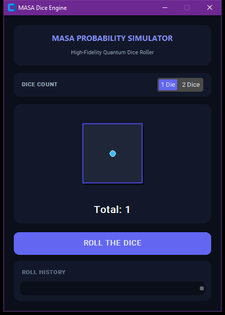

# MASA Probability Simulator

A high-fidelity probability simulation tool featuring dynamic canvas-rendered dice roll animations and statistical rolling history.

## Technical Architecture

The codebase follows modular software engineering patterns and OOP structure, designed for reliability, high maintainability, and clean separation of concerns:

- **Component Layering**: User interface and computational state are decoupled into specialized controllers and event loops.
- **Defensive Engineering**: Comprehensive validation guards protect against malformed inputs and runtime exceptions.
- **Modern Design Tokens**: Designed with a high-contrast dark aesthetic adhering to modern developer tooling visual standards.


## Preview


## Features

- Single-die and dual-dice operational simulation modes.
- Multi-frame canvas animation rendering real-time rolling effects.
- Statistical session history tracking with cumulative score summaries.
- Clean CustomTkinter control panel and modular event handlers.

## Prerequisites

- Python 3.10 or higher
- Required packages:

```bash
pip install customtkinter
```

## Execution

Initialize and run the module via the command line:

```bash
python "Dice Rolling Simulator in Python/index.py"
```

## Project Structure

```
.
├── Dice Rolling Simulator in Python
├── LICENSE             # MIT License
└── README.md           # Developer documentation
```

## License

This project is licensed under the terms of the MIT License. Refer to the `LICENSE` file for details.

